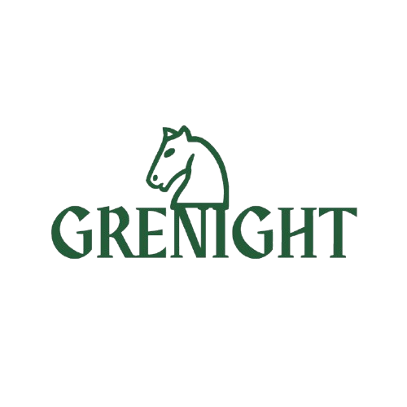

# Grenight — Green Knight Chess Platform

Grenight started as a way to exercise the integration and implementation of multiple technologies, while working through the fundamentals of structural, object-oriented, and functional programming, and system design. Along the way came the realization that processing a single chess move can be treated much like a stateless math script — and that idea became the foundation of Grenight, the Green Knight Chess Platform.

The goal of the final product is a production-ready chess platform where players can play matches in their browser, either against each other or against my own agent. Given the complexity of the project — from building the chess logic and exposing it as a stateless API, to building an agent, integrating it with the frontend, and making the whole thing production-ready as platfrom — project will pass through several phases.

  

